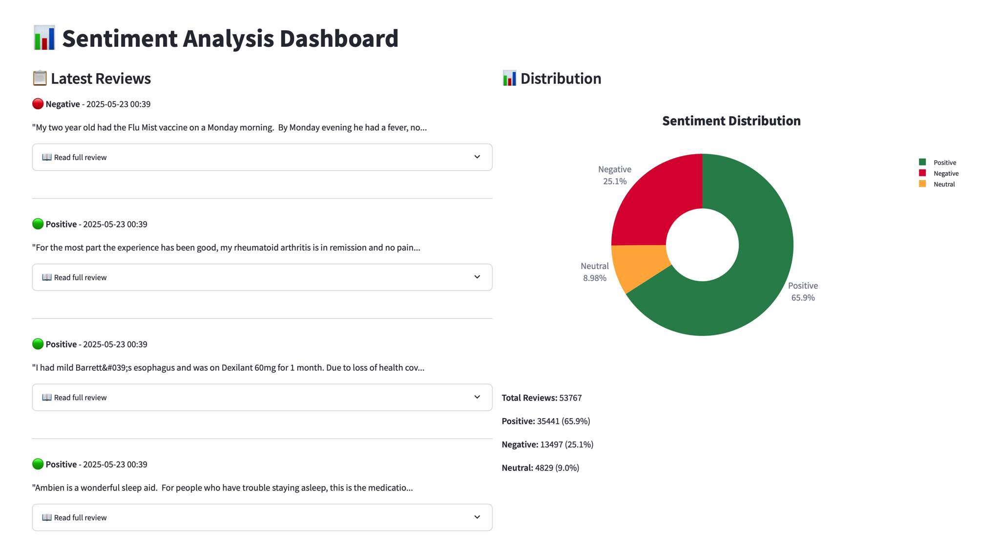

# Healthcare Sentiment Analysis Dashboard

This project provides a sentiment analysis system for healthcare/drug reviews with a FastAPI backend and Streamlit dashboard visualization.

## Features

- Real-time sentiment analysis of drug reviews using a fine-tuned Mistral language model
- Classification of reviews into Positive, Negative, or Neutral sentiments
- Interactive dashboard built with Streamlit showing sentiment distribution
- MongoDB integration for storing and analyzing historical data
- FastAPI backend for efficient API endpoints

## System Architecture

- **Backend (FastAPI)**: Handles sentiment analysis requests and database operations
- **Frontend (Streamlit)**: Provides interactive data visualization
- **Database (MongoDB)**: Stores review texts and their sentiment analysis results
- **Model**: Fine-tuned Mistral model optimized for healthcare sentiment analysis

## Setup and Installation

1. Clone the repository:

git clone https://github.com/sontung2310/Sentiment-Analysis-in-Healthcare.git

2. Install dependencies:

pip install -r requirement.txt

3. Set up environment variables:
   - Create a `.env` file in the root directory
   - Add your MongoDB connection string: `MONGODB_URI=your_connection_string`
   - Add your Huggingface API: `HUGGINGFACE_API_KEY=your_api_string`

4. Run the applications:
   - ExploratoryData Analysis (EDA) and Run inference on the 4-bit version of Mistral-7B: `inference_mistral7B.ipynb`
   - Fine-tune Mistral 7B model: `finetuning_mistral.ipynb` 
   - Start FastAPI server: `python app.py` (If you are running it in Google Colab, use `uvicorn app:app --reload`)
   - Launch Gradio UI for feedback: `gradio_ui.ipynb`
   - Launch Streamlit dashboard: `streamlit run report_healthcare.py`

5. Demo Healthcare Report:
   
   
   The dashboard provides:
   - Real-time sentiment distribution visualization
   - Interactive donut chart showing the proportion of positive, negative, and neutral reviews
   - Clean and intuitive interface for easy data interpretation

